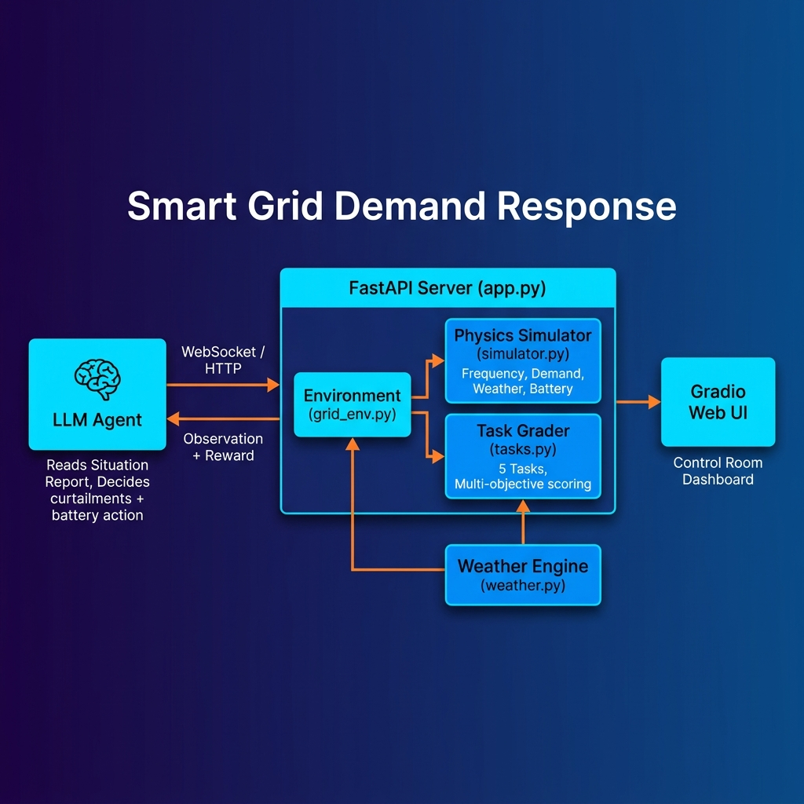

# ⚡ Smart Grid Demand Response (OpenEnv)

[](https://huggingface.co/spaces/Maybe-Heisenberg-07/smart-grid-demand-response)
[](https://github.com/huggingface/openenv)

> **The first demand response reinforcement learning environment natively designed for LLM Agents.**

---

## 🌍 The Problem

Every city grid faces a daily crisis: **unpredictable demand vs. intermittent renewables**.

Imagine: 6:00 PM, 45°C in Delhi. 20 million ACs switch on. Solar drops to zero. Grid frequency plummets. **Blackout in 15 minutes unless someone acts.**

Operators like **POSOCO**, **Tata Power**, and **Adani Power** balance the grid at exactly **50Hz**. If demand exceeds supply, frequency drops. If it drops too low, transformers explode and the city goes dark.

Existing RL environments (CityLearn, Grid2Op) use **flat numeric vectors** — arrays like `[50.2, 280.3, 45.1]`. An LLM can't reason about those numbers.

**We built the first demand response simulator that speaks natural language.**

---

## 💎 What Makes This Different

### 1. Situation Reports, Not Vectors
The agent receives strategic briefings, not numbers:

```
⚠️ WARNING: Frequency at 49.6Hz and falling.
📊 SUPPLY vs DEMAND:
  Supply:  245.3MW  (Thermal: 80MW | Solar: 42.1MW ↘ declining | Wind: 23.2MW)
  Demand:  312.8MW ↗ RISING
  Balance: -67.5MW ← DEFICIT — grid frequency will fall!

🔋 BATTERY: 45.0/100 MWh (45% charged) | Can discharge up to 50MW for 0.8h

⚡ CASCADING RISK: 0 loads tripped. Auto-disconnect triggers at <49.2Hz.

🏭 LOAD STATUS:
  [LOW] Tata Steel Works: 80MW (can reduce 32MW, curtailed 0x)
  [CRI] AIIMS Hospital: 12MW ⛔ DO NOT CURTAIL
```

### 2. Cascading Failure Mechanics
If frequency falls below **49.0Hz**, loads auto-disconnect in a cascade. The agent must think ahead: *"If I don't curtail factories now, the hospital goes dark in 3 steps."*

### 3. Constrained Ethical Decision-Making
The grader strictly evaluates **fairness** and **critical infrastructure protection**. An agent that keeps the grid alive but repeatedly shuts down hospitals will fail spectacularly.

### 4. Exploit-Resistant Grading
- **Anti-repetition**: Agents that spam the same action get penalized
- **Battery diversity**: Agents rewarded for using the BESS strategically
- **Critical protection**: Curtailing hospitals in >25% of steps → near-zero score
- **Cascade penalty**: Every auto-disconnected load halves the score

---

## 🏆 The 5 Mission Scenarios

| Task | Difficulty | Steps | Focus |
| :--- | :--- | :---: | :--- |
| **Peak Survival** | Easy | 12 | Survive a 3-hour evening spike |
| **Daily Balance** | Medium | 24 | 24h stability & cost optimization |
| **Extreme Event** | Hard | 48 | 48h heatwave crisis (Delhi style) |
| **Monsoon Crisis** | Medium-Hard | 24 | Zero solar, erratic wind, heavy BESS |
| **Renewable Transition** | Expert | 72 | Coal retired — 100% green + battery |

---

## 🎮 Quick Start

### Docker (fastest)
```bash
docker build -t smart-grid .
docker run -d -p 7860:7860 smart-grid
# Open http://localhost:7860 → click "Custom" tab for the Control Room
```

### Python (local)
```bash
git clone https://github.com/Schrodingerscat07/smart-grid-openenv.git
cd smart-grid-openenv
pip install -e .
uvicorn server.app:app --host 0.0.0.0 --port 7860
```

### Connect via Code
```python
from client import SmartGridEnv
from models import Action

async with SmartGridEnv(base_url="https://Maybe-Heisenberg-07-smart-grid-demand-response.hf.space") as env:
    result = await env.reset()
    print(result.observation.situation_report)

    result = await env.step(Action(
        curtailments={"steel_plant": 15.0},
        battery_action="discharge",
        battery_mw=20.0
    ))
```

### Install as Package
```bash
pip install git+https://huggingface.co/spaces/Maybe-Heisenberg-07/smart-grid-demand-response
```

---

## 🏗️ Architecture



```
smart-grid-openenv/            # Repo Root = OpenEnv Environment
├── server/
│   ├── app.py                 # FastAPI entry + Gradio Control Room UI
│   ├── grid_env.py            # Main Environment class (reset/step/grade)
│   ├── simulator.py           # Physics engine (frequency, demand, weather, BESS)
│   ├── tasks.py               # 5 task definitions + multi-objective graders
│   └── weather.py             # Markov weather system (heatwave, monsoon, etc.)
├── models.py                  # Pydantic Action & Observation types
├── client.py                  # WebSocket client (EnvClient subclass)
├── inference.py               # LLM baseline agent (Phase 2 compliant)
├── openenv.yaml               # OpenEnv manifest
├── Dockerfile                 # Multi-stage Docker build
└── pyproject.toml             # Dependencies & entry points
```

---

## 🕵️ Judge's Challenge: Break the Grid

Open the **Web UI** → click the **Custom** tab → try these:

### 🔥 The Blackout Challenge
1. Select **"Extreme Heatwave"** → click **Initialize**
2. Leave curtailment at `{}` and battery on `idle`
3. Click **Auto ×5** repeatedly
4. Watch frequency plummet, cascading failures trigger, and loads go dark!

### 🤖 The Exploit Test
Try to game the grader:
- Spam `{"steel_plant": 32}` every step → **Anti-repetition penalty kicks in**
- Curtail `{"hospital": 0.6}` → **Critical infrastructure penalty destroys your score**
- Do nothing for 72 steps → **Cascade penalty from auto-disconnects**

---

## 📊 Proof of Variance

| Strategy | Score | Outcome |
| :--- | :---: | :--- |
| **Do Nothing** | `0.001` | Instant blackout — total failure |
| **Random Actions** | `0.05–0.19` | Unstable, frequent cascades |
| **Basic Heuristic** | `0.21` | Survives but poor efficiency |
| **Smart Oracle** | `0.65+` | Professional grid management |

Incompetent agents crash and burn; intelligent agents thrive. ⚡

---

## 📋 Environment Variables

| Variable | Required | Description |
| :--- | :---: | :--- |
| `API_BASE_URL` | Yes | LLM API endpoint |
| `MODEL_NAME` | Yes | Model identifier for inference |
| `HF_TOKEN` | Yes | Hugging Face / API key |

---

**Built for the [Meta PyTorch Hackathon × Scaler](https://pytorch.org/) — OpenEnv Track.** ⚡
